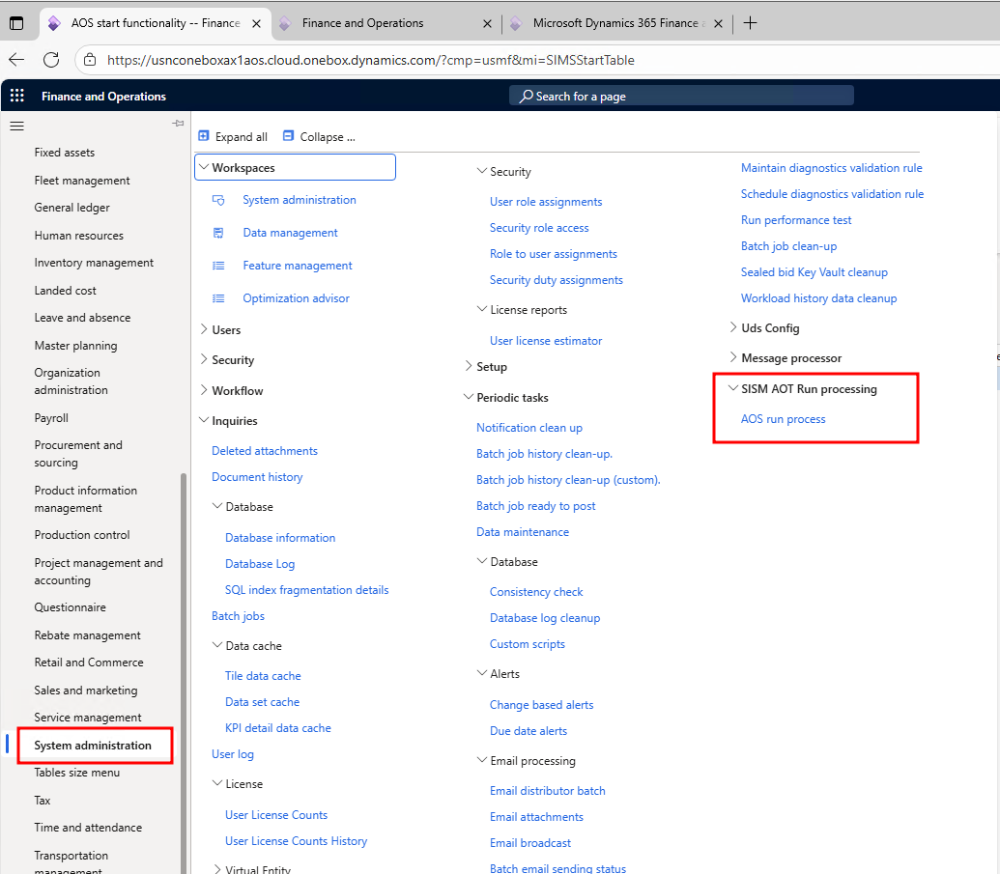
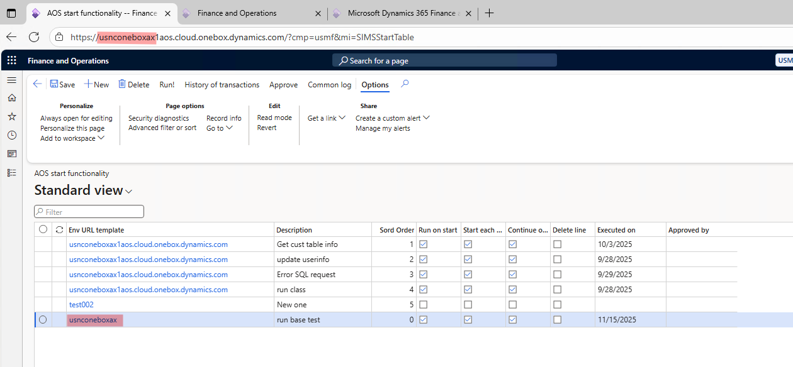
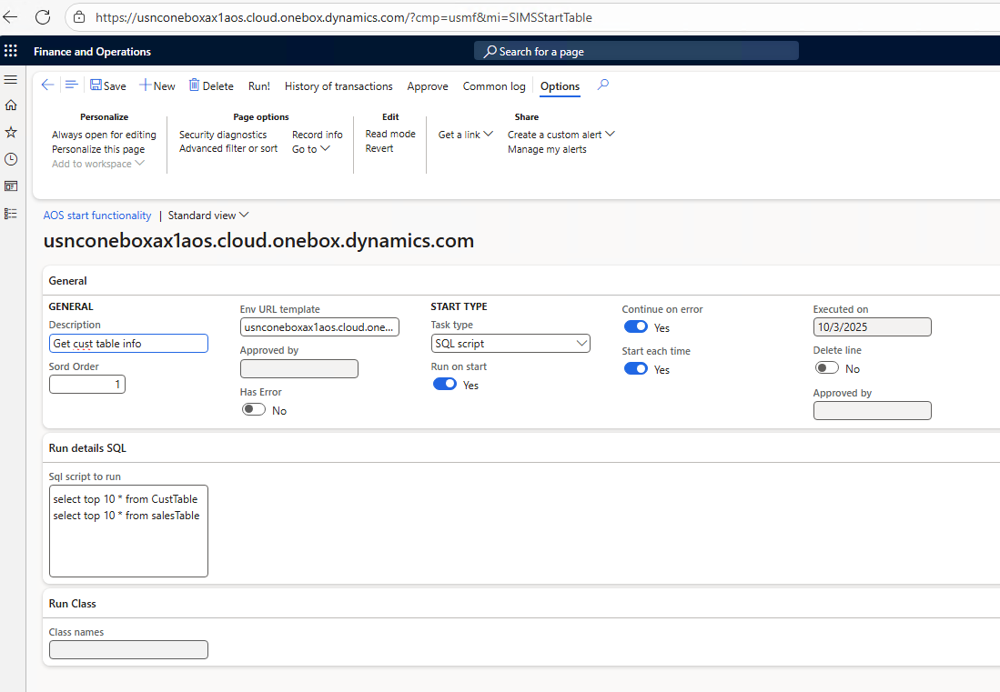
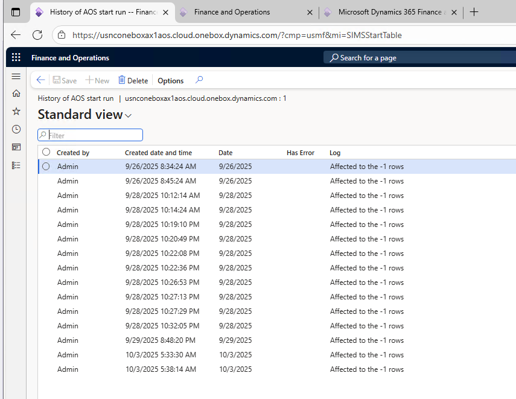
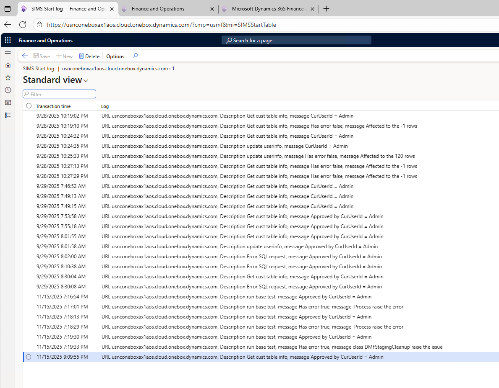
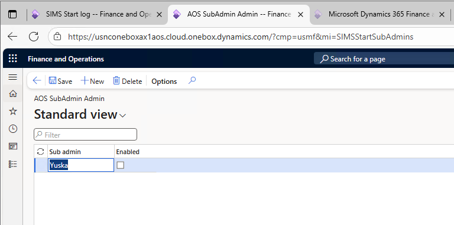

## ⚠️ Warning and Disclaimer

**Warning:** This project may involve risks and potentially dangerous operations. Use it at your own risk.

**Disclaimer:** The author and contributors are not responsible for any damage, loss, or injury resulting from the use of this software. By using this project, you acknowledge and accept all associated risks.

Please exercise caution and ensure you fully understand the implications before proceeding.

A brief overview is available [here](https://youtu.be/L4anM9fJYiU).

---

# 📘 Short User Guide

## ⚙️ Setup Processing

To start the process, navigate to:

`System administration > SIMS AOT > Run Processing`

---

## 🚀 Main Execution Logic

When AOS starts (i.e., batch job servers are launched), the system checks for the existence of the batch job `AOS Start task processor`. If it doesn't exist, the system creates it automatically.

This processor retrieves all records from the `AOS start functionality` form and evaluates whether the conditions match the current environment. The first check compares the current environment's URL against the `Env URL template` field.

All processing is executed within the `AOS Start task processor` batch job.

---

## 📋 Field Overview

| Name | Example | Description |
|------|---------|-------------|
| Description | Get cust table info | A brief human-readable description of the step |
| Sort order | 1 | Determines execution order when multiple steps are defined |
| Env URL template | usnconeboxax1aos.cloud.onebox.dynamics.com | Template used to match the environment URL |
| Approved by | Admin | Indicates who approved the record for execution |
| Has Error | No | Displays whether the last execution resulted in an error |
| Task type | SQL script | Defines the execution type: SQL script, Class, or RunBase implementation |
| Run on start | Yes | Specifies whether the step should run on AOS startup |
| Continue on error | Yes | Allows subsequent steps to run even if this one fails |
| Start each time | Yes | If set to "No", the step runs only once on startup; otherwise, it runs every time |
| Executed on | 10/3/2025 | Timestamp of the last execution |
| Delete line | No | If set to "Yes", the line is deleted after execution (useful for sensitive data). Execution results are logged separately |
| Approved by | Admin | Last approver of the line |
| SQL script to run | `update userinfo set enable = 1` | Executed if `Task type` is `SQL script`. Uses `statement.executeUpdateWithParameters` with limitations |
| Class names | DMFStagingCleanup | If `Task type` is `Class`, the class must implement `SIMSStartActionRunClassInterface` with `run` and `resultMessage` methods. If `RunBase implementation`, it must implement `SysRunnable` with a `run` method |

---

## 🧭 Button Descriptions

### ▶️ `Run!`

Executes the selected line immediately. The line must be approved and meet all conditions (e.g., matching URL template).

### 📜 `History of transactions`

Opens a form showing the transaction history for the selected line.

The log displays SQL execution results or messages from class runs. Entries can be deleted.

### ✅ `Approve`

Only users with `admin` or `sub admin` roles can approve lines. If you're not one of them, request approval from someone who has access. Details on the approval process are provided below.

### 📘 `Common log`

Displays a form with general logs, including approval actions, deletions, and execution results. You can see who ran the line, when, and how.

---

## 🔐 Approval Process

Only approved lines can be executed. You cannot run your own line unless it’s approved by another user. The exception is the `admin` user, who can approve and run their own lines.

Often, `admin` is a service account without regular access to the system. To address this, `sub admin` users can be created by `admin` and granted full administrative rights within this module.

### How to open the `Sub Admin` form

Use the following URL format:

`<base URL>...mi=SIMSStartSubAdmins`

Example:
`https://usnconeboxax1aos.cloud.onebox.dynamics.com/?cmp=usmf&mi=SIMSStartSubAdmins`

Sub admin form
Only Admin or Sub admin users can modify data in this form.
You can also run the form in ADMIN mode:
`https://usnconeboxax1aos.cloud.onebox.dynamics.com/?cmp=usmf&mi=SIMSStartSubAdmins&user=Admin`

Using `&user=Admin` allows any user to modify records in this form.
